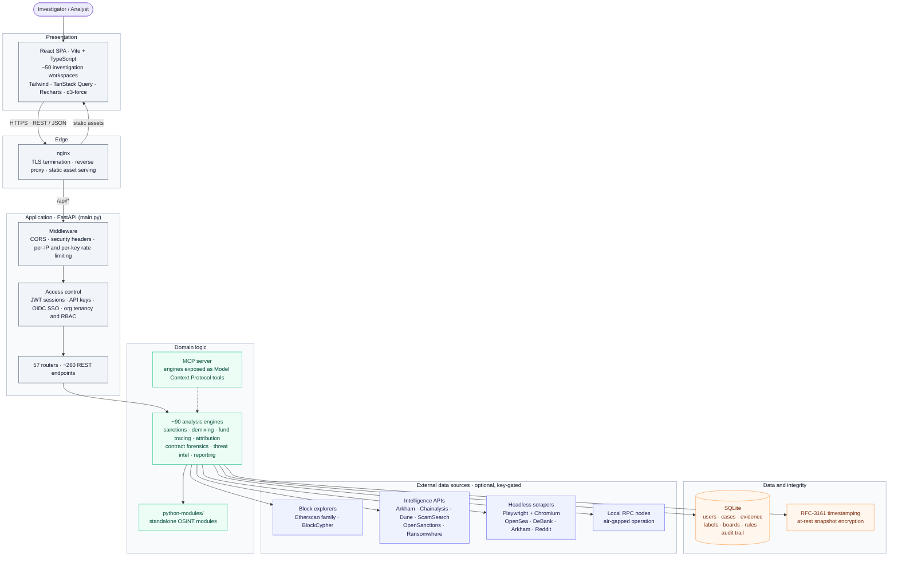
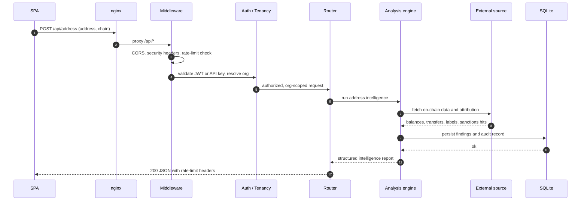
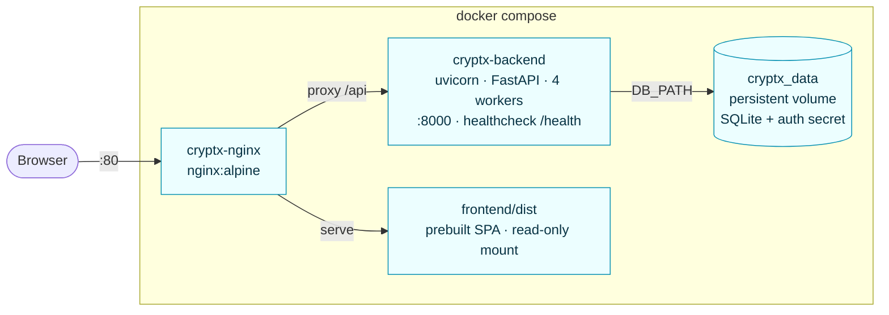

<div align="center">

# CrypTX Blockchain Investigator

**A full-stack platform for cryptocurrency cybercrime investigation, blockchain forensics, and compliance.**

[](https://github.com/Drvirus0x0FAC/Cryptx/actions/workflows/ci.yml)
[](LICENSE)
[](https://www.python.org/)
[](https://react.dev/)
[](https://fastapi.tiangolo.com/)

</div>

---

## Overview

CrypTX is a platform for investigating cryptocurrency-enabled crime. Give it a
wallet address, a transaction, a named entity, or a full case file, and it returns
a structured intelligence picture: who is likely behind the funds, where the money
came from and where it went, which sanctions or watch lists are implicated, and how
exposed the activity is to mixers, bridges, and known illicit infrastructure.

Around that core, CrypTX provides the workflow an investigation actually needs:
entity and counterparty attribution, multi-hop fund-flow reconstruction across
chains, mixer and bridge demixing, sanctions and VASP screening, regulatory report
drafting, threat-intelligence correlation, link-analysis boards, evidence handling
with tamper-evident timestamping, and court-oriented reporting.

It covers 30+ blockchains across the EVM, UTXO, and major account-model families,
and runs fully self-contained by default. Every third-party data source is optional
and used only when you supply an API key, so CrypTX can operate in restricted or
air-gapped environments without disclosing investigation targets to outside
services.

CrypTX is built for financial-crime investigators, VASP and exchange compliance
teams, incident responders, and asset-recovery practitioners.

> **Authorized use only.** CrypTX is intended for lawful investigations, regulatory
> compliance, security research, and education. You are responsible for complying
> with all applicable laws, data-source terms of service, and privacy regulations
> in your jurisdiction. See [Legal & responsible use](#legal--responsible-use).

---

## Key capabilities

### Address & transaction intelligence
- **Address Intel** balance, token holdings, activity, sanctions screening, mixer/bridge exposure, attribution, and open-source abuse/scam reports in one report.
- **Transaction Lens** decode and interpret individual transactions, including contract interactions and swap semantics.
- **Fund Tracer** multi-hop breadth-first fund-flow graphs (1–5 hops, linear or wide expansion) with pattern alerts (peel chains, fan-out, consolidation).
- **Holistic Trace** deep chain analysis that prefers a local node when one is configured.

### Attribution & entities
- **Entity Investigation & Attribution Lookup** resolve addresses to known entities, exchanges, services, and threat actors.
- **Entity Search** fuzzy name/alias search across curated and open label sets.
- **Label Intelligence** label-growth pipeline that expands coverage from seed clusters.
- **Clustering** co-spend and behavioral heuristics for wallet grouping.

### Compliance & regulatory
- **Sanctions Screener** OFAC plus multi-jurisdiction lists, address and fuzzy-name matching.
- **VASP Directory** Know-Your-VASP attribution for counterparty addresses.
- **Regulatory Reports** draft **SAR** and **FATF Travel Rule / IVMS101** messages, auto-enriched from investigation context.
- **Compliance Suite & Stablecoin Compliance** screening workflows and issuer-freeze context.

### Advanced forensics
- **Demixing Lab** pair Tornado Cash deposits with withdrawals; reconcile cross-chain bridge transfers.
- **Laundering Trace** end-to-end placement → layering → integration reconstruction.
- **Contract Forensics** malicious-contract and approval-exposure analysis.
- **Memecoin & Scam Infrastructure** rug-pull, honeypot, and scam-network mapping.
- **NFT / TRON Sentinel** full NFT and TRON investigations, including live OpenSea lookups.
- **DEX & Perp-DEX Analysis** Uniswap v2/v3, PancakeSwap, and perpetuals venue history, buy/sell ratios, and wash-trade detection.

### Threat intelligence
- **Threat Feeds & Threat Intel** ingest and correlate ransomware, abuse, and IOC feeds.
- **Ransomware Intelligence** strain attribution and payment-address tracking.
- **Predictive Intelligence** risk-forward scoring on entities and flows.
- **Blockchain Threat Landscape** aggregated situational view.

### Casework & court readiness
- **Case Manager** cases, tasks, collaborators, and audit trail.
- **Evidence Vault** hashed evidence storage with optional **RFC-3161 trusted timestamping** for tamper-evidence.
- **Boards** link-analysis canvas with shareable read-only snapshots.
- **Court Readiness / Daubert** measured-error-rate benchmark harness and notarization workflow for expert-testimony support.
- **Report Studio & Mega Report** consolidated investigation reports for export.

### Intake & monitoring
- **Victim Portal** public intake form for scam/fraud victims that feeds structured case data.
- **Wallet Monitor** watch addresses and receive alerts on movement or risk changes.
- **Batch Screener** bulk address screening.
- **OSINT Sweep** automated open-source enrichment pass.
- **Auto-Investigate** orchestrated investigation pipeline over a single input.

### AI & automation
- **AI Agent / Copilot** natural-language investigation assistant (pluggable LLM provider; DeepSeek supported out of the box).
- **MCP Server** exposes core engines as [Model Context Protocol](https://modelcontextprotocol.io/) tools for Claude Desktop, Cursor, Zed, and other MCP clients. See [`backend/MCP_SERVER.md`](backend/MCP_SERVER.md).
- **Rule Builder** custom detection rules over investigation output.

---

## Supported chains

30+ chains across EVM, UTXO, and account-model families:

| Family | Chains |
|---|---|
| **EVM** | Ethereum, Polygon, BNB Smart Chain, Arbitrum, Optimism, Base, Avalanche, Fantom, Mantle, Moonbeam, ZetaChain |
| **UTXO** | Bitcoin, Litecoin, Dogecoin, Bitcoin Cash |
| **Account / other** | Tron, Solana, XRP, TON, NEAR, Cardano, Polkadot, Cosmos, Monero, Stellar, Algorand, Aptos, Sui, Kaspa, Stacks, Internet Computer |

Depth of coverage varies by chain and by which data-source API keys are configured.

---

## Architecture

A single FastAPI service fronts roughly 90 analysis engines and a bundled SQLite
store. A React single-page app is the only client. Every external data source is
optional and gated behind a configured API key, so the platform runs fully
self-contained by default.

### System overview



### Request lifecycle

A representative address-intelligence lookup, from browser to structured report:



### Deployment topology

`docker compose up` brings up two containers and one persistent volume:



### Tech stack

| Layer | Technology |
|---|---|
| **Backend** | Python 3.12, FastAPI, Uvicorn, Pydantic v2, aiohttp / httpx |
| **Frontend** | React 18, TypeScript, Vite, Tailwind CSS, TanStack Query, React Router, Recharts, d3-force, i18next |
| **Database** | SQLite (bundled; no external driver). Postgres planned. |
| **Auth** | JWT sessions, API keys (`ctxk_` prefix), optional OIDC SSO (Google, Microsoft Entra, Okta, Keycloak) |
| **Integrity** | RFC-3161 trusted timestamping, at-rest encryption for shared board snapshots |
| **AI** | Pluggable LLM provider; MCP server via `fastmcp` |
| **Deployment** | Docker multi-stage build, Docker Compose, nginx reverse proxy |
| **CI** | GitHub Actions backend pytest, frontend typecheck + build, Docker image build |

---

## Getting started

### Prerequisites

- **Python 3.12+**
- **Node.js 20+**
- **Docker** (optional, for containerized deployment)

### Option A local development

```bash
git clone https://github.com/Drvirus0x0FAC/Cryptx.git
cd Cryptx

# 1. Backend
cd backend
python -m venv venv && source venv/bin/activate      # Windows: venv\Scripts\activate
pip install -r requirements.txt
playwright install chromium                            # for live NFT / scraper lookups
cd ..

# 2. Frontend
cd frontend
npm install
cd ..

# 3. Configure
cp .env.example .env                                   # fill in AUTH_SECRET at minimum
```

Run both servers together:

```bash
./start.sh            # macOS / Linux
start.bat             # Windows
```

Or run them separately:

```bash
# terminal 1
cd backend && python -m uvicorn main:app --reload --port 8000

# terminal 2
cd frontend && npm run dev
```

| Service | URL |
|---|---|
| Frontend | http://localhost:5173 |
| API | http://localhost:8000 |
| API docs (dev only) | http://localhost:8000/docs |
| Health check | http://localhost:8000/health |

### Option B Docker Compose (production-style)

```bash
cp .env.example .env          # AUTH_SECRET is REQUIRED
docker compose up -d --build
```

nginx serves the built frontend and proxies `/api` to the backend on
**http://localhost**. The SQLite database persists in the `cryptx_data` volume.

---

## Configuration

All configuration is environment-driven. Copy `.env.example` to `.env` and set values.
Full documentation is inline in [`.env.example`](.env.example).

| Variable | Required | Purpose |
|---|:--:|---|
| `AUTH_SECRET` | **Yes (prod)** | JWT signing secret. Auto-generated to `backend/.auth_secret` in dev; set explicitly in production so sessions survive redeploys. |
| `BASE_URL` | No | Public deployment URL (SSO callbacks, absolute links). |
| `ENVIRONMENT` | No | `production` disables `/docs`, `/redoc`, and `/openapi.json`. |
| `DB_PATH` | No | SQLite path. Defaults to `backend/cryptoosint.db`. |
| `CORS_ORIGINS` | No | Comma-separated additional allowed origins. |
| `LOCAL_RPC_URLS` | No | JSON map of `chain → RPC URL`. When set, EVM fetchers prefer your node over public explorers enables **air-gapped** operation. |
| `MULTI_TENANT` | No | `0` disables org scoping (legacy single-user mode). Enabled by default. |
| `TSA_URL` | No | Accredited RFC-3161 TSA endpoint for evidence timestamping. |
| `OIDC_<PROVIDER>_*` | No | OIDC SSO configuration (one block per provider). |
| `AI_PROVIDER`, `DEEPSEEK_API_KEY`, … | No | LLM provider for the AI agent / copilot. |

### External data-source API keys

CrypTX runs without any external keys but degrades gracefully to richer data when
they are present. Configure them in the in-app **Settings** page, or in `.env` for
headless deployments.

| Key | Enables |
|---|---|
| `ETHERSCAN_API_KEY` | Multi-chain EVM lookups (ETH, Polygon, BSC, Arbitrum, Optimism, Base) |
| `ARKHAM_API_KEY` | Entity attribution (exchanges, mixers, threat actors) |
| `CHAINALYSIS_API_KEY` | Real-time sanctions screening |
| `SCAMSEARCH_API_KEY` | Community scam reports |
| `BLOCKCYPHER_TOKEN` | Richer Bitcoin transaction data |
| `THEGRAPH_API_KEY` | Higher rate limits for DEX subgraphs |
| `ETHPLORER_API_KEY`, `UD_API_KEY` | Token/holder data, Unstoppable Domains resolution |
| `DUNE_API_KEY` + `DUNE_LABELS_QUERY_ID` | Curated Dune label queries |

Open datasets (OpenSanctions, Ransomwhere, BitcoinAbuse, CryptoScamDB, CoinGecko,
DefiLlama) require **no key** and are refreshed via:

```
POST /api/public-enrichment/refresh
```

---

## Project structure

```
Cryptx/
├── backend/                 FastAPI service
│   ├── main.py              app: middleware, auth, rate limiting, router wiring
│   ├── routers/             57 API routers (~260 endpoints)
│   ├── *.py                 ~90 analysis engines (sanctions, demix, tracing, …)
│   ├── mcp_server.py        Model Context Protocol server
│   ├── tests/               pytest suite + golden fixtures
│   ├── benchmarks/          Daubert measured-error-rate harness
│   └── requirements.txt
├── frontend/                React + Vite SPA
│   ├── src/pages/           ~50 investigation workspaces
│   ├── src/components/      shared UI, graph views, charts
│   └── src/api/, src/auth/, src/hooks/, src/i18n/
├── python-modules/          standalone OSINT modules (added to sys.path at runtime)
├── scripts/                 operational scripts (tenant-isolation audit, …)
├── tests/                   end-to-end / UAT harnesses (.mjs) run against a live backend
├── deploy/                  nginx reverse-proxy config
├── Dockerfile               multi-stage: frontend build → Python runtime + Chromium
├── docker-compose.yml       backend + nginx, persistent volume
└── .github/workflows/ci.yml GitHub Actions pipeline
```

---

## Testing

```bash
# Backend unit tests (no network or DB required)
cd backend && python -m pytest -v

# Tenant-isolation audit
python scripts/audit_tenant_isolation.py

# Frontend typecheck + build
cd frontend && npm run build
```

The `tests/*.mjs` harnesses are integration/UAT suites that require a seeded, running
backend and are **not** part of CI run them manually or on a nightly schedule.

---

## Security

- **Secrets never leave your deployment.** `.env`, `backend/.auth_secret`, session
  cookies, and the SQLite database are git-ignored and must not be committed.
- **Production hardening:** interactive API docs are disabled when
  `ENVIRONMENT=production`; security headers (`X-Content-Type-Options`,
  `X-Frame-Options`, `Referrer-Policy`, `Permissions-Policy`) are applied globally;
  per-IP and per-API-key rate limiting is enforced.
- **Multi-tenancy:** org-scoped data access is enabled by default. Run
  `scripts/audit_tenant_isolation.py` after changes to catch unscoped queries.
- **Air-gap mode:** set `LOCAL_RPC_URLS` to keep on-chain lookups on infrastructure
  you control no investigation targets are disclosed to third-party explorers.
- Found a vulnerability? Please open a private security advisory rather than a public issue.

---

## Roadmap

- Redis-backed distributed rate limiting (multi-worker consistency)
- PostgreSQL as an alternative to SQLite (driver + compose profile stubbed in)
- Expanded non-EVM chain coverage

---

## Legal & responsible use

CrypTX is provided for **lawful** financial-crime investigation, regulatory
compliance, security research, and education. Before using it you must ensure you
have the authority to investigate the addresses, transactions, and entities in
question, and that your use complies with:

- applicable laws and regulations in your jurisdiction,
- the terms of service of every data source and API you configure,
- data-protection and privacy law regarding any personal data you process.

The maintainers accept no liability for misuse. Draft SAR / Travel Rule outputs,
attribution, and risk scores are investigative aids, not legal determinations, and
must be reviewed by a qualified human before any reporting or enforcement action.

---

## Contributing

Issues and pull requests are welcome. See [CONTRIBUTING.md](CONTRIBUTING.md) for
setup, the checks a change must pass, and submission guidelines.

---

## License

Released under the [MIT License](LICENSE).

## Built with

FastAPI, React, Vite, Tailwind CSS, Playwright, and open blockchain-intelligence
datasets including OpenSanctions and Ransomwhere.
